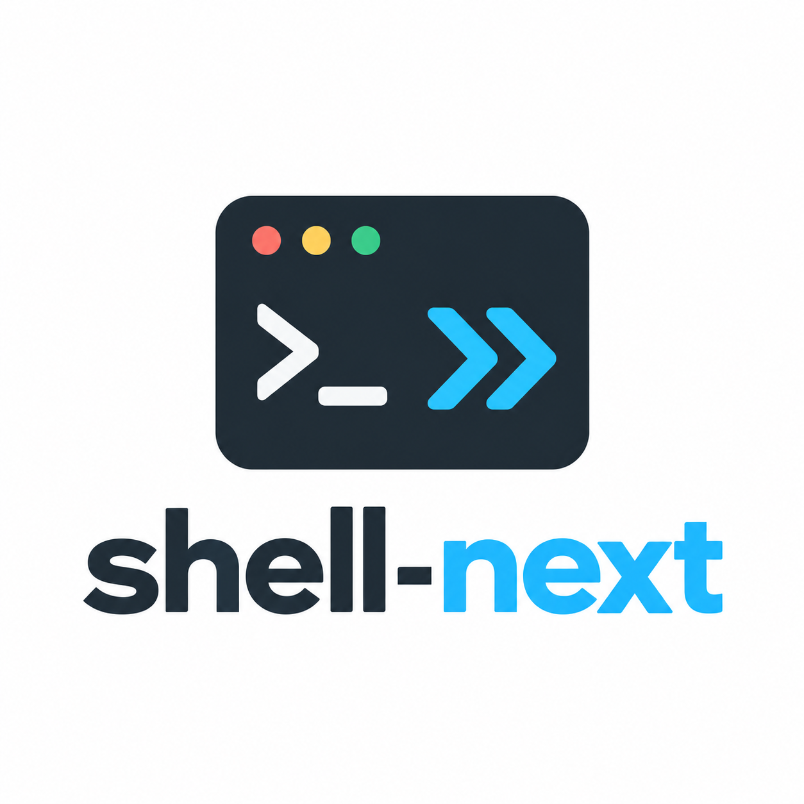

# Shell state that stays with you

<div class="hero">
  
  <div>
    <p class="version">shell-next 0.1.2 · Python 3.14+</p>
    <p>Persistent asynchronous Bash, PowerShell, and cmd sessions. Own commands through completion, interact with prompts, and test the same application code with a deterministic mock.</p>
    <a class="button" href="getting-started/">Get started</a>
    <a class="button secondary" href="https://github.com/gokurakujoudo/shell-next">View on GitHub</a>
  </div>
</div>

```console
python -m pip install shell-next
```

## One session, three ways to work

| Interface | Use it when |
| --- | --- |
| `await shell.run(command)` | You want a finalized result and managed cleanup. |
| `async with shell.command(command) as handle` | You need to send input or observe a live command within a scope. |
| `handle = shell.submit(command)` | You want a session-owned handle immediately and will observe it separately. |

Use structural `ProcessCommand` arguments for executables, or `SessionScript`
for the selected shell's native language. Working directories, exported
environment variables, and native shell state persist between normal commands.

## Built for observable execution

- **Bounded capture.** Separate stdout/stderr tails, optional durable files, and
  independent subscribers that cannot block primary capture. Configure tail
  limits with `CaptureConfig(tail_bytes=...)`; the default is 64 KiB per stream.
- **Convenient results.** Retain original commands and decode stdout/stderr
  tails with `stdout_str()` and `stderr_str()`. Read bounded representations of
  records and live session/command state for diagnostics.
- **Explicit ownership.** Cancelling an observation leaves execution running;
  cancelling a command owner initiates cleanup.
- **Deterministic tests.** Inject `MockShellSession` through the normal session
  configuration. Declare expected commands, input, output, failures, and virtual time.
- **Backend honesty.** Discover supported features before execution. Forced
  interruption invalidates the session; there is no hidden restart.

## Find your next step

- [Getting started](getting-started.md): choose a backend and run your first command.
- [Usage guide](usage.md): input, deadlines, results, capture, and sudo.
- [Backend support](backends.md): Linux and Windows guarantees and limitations.
- [Testing applications](testing.md): test production call paths without starting a shell.
- [Troubleshooting](troubleshooting.md): diagnose startup, input, and output issues.

The first release passed Windows, Linux, and RHEL 8 contracts, installed-wheel
checks, static analysis, and 100% combined branch coverage.
[Release 0.1.0](https://github.com/gokurakujoudo/shell-next/releases/tag/v0.1.0)
contains the source and wheel distributions.
